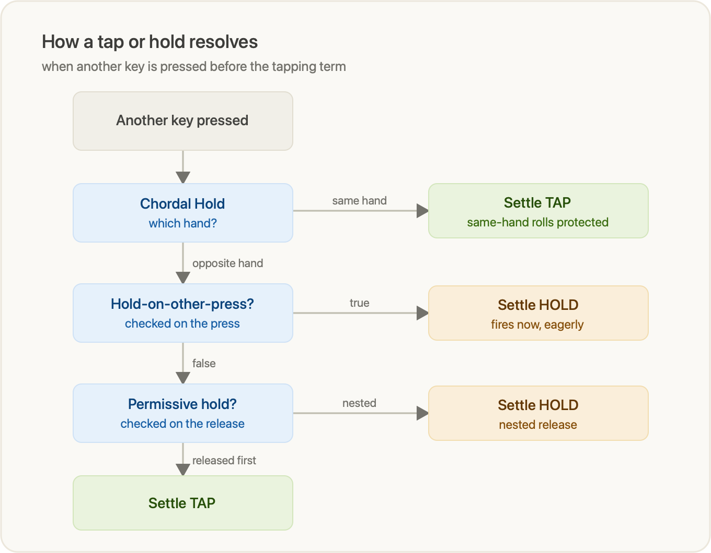
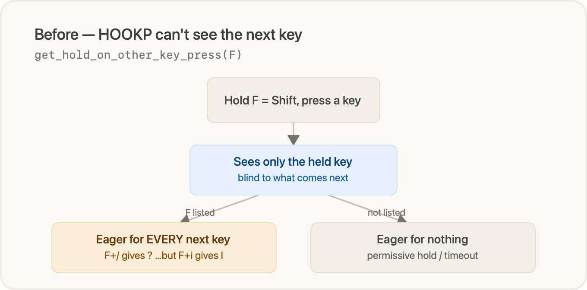
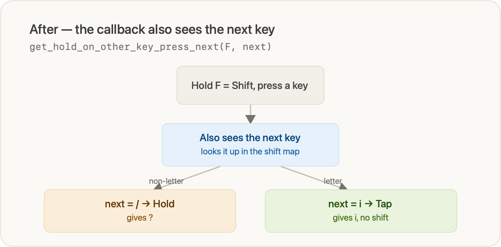

# Voyager Keyboard Helper

A bridge between **[ZSA Oryx](https://configure.zsa.io)** and **raw QMK**.

Design your layout in Oryx's GUI, then let this tool automatically inject the
QMK firmware-level features Oryx can't express — advanced tap/hold tuning,
custom per-key C callbacks, unlimited-length macros, even small patches to QMK
core — and flash it. One command, every time you re-export.

---

## Setup

```bash
# 1. Install deps
npm install

# 2. Check out ZSA's QMK fork somewhere on your machine
git clone https://github.com/zsa/qmk_firmware

# 3. Create your config from the template and edit the paths
cp config.template.js config.js
```

Edit [`config.js`](config.template.js) to point at your `qmk_firmware` checkout,
your keymap name, and the Oryx export filename pattern.

Then design your layout in Oryx, download the **QMK source** zip to `~/Downloads`,
and run:

```bash
node updateKeyboard.js
# or, if you put it on your PATH:
./flashKeyboard.sh
```
---

## Why not just Oryx?

Oryx is excellent at what it does: a visual layout editor, layers, RGB, combos,
tap-dance, basic mod-taps, and one-click flashing. But the moment you want
firmware behaviour Oryx doesn't expose, you're stuck with two bad options: fork
QMK and hand-maintain a full keymap (losing the GUI and re-doing it on every
change), or give up.

This helper gives you **both**. You keep the entire Oryx workflow — visual
editing, RGB, layer training — and layer QMK power on top **reproducibly**. Each
time you re-export from Oryx, one command re-applies your customizations onto the
fresh export and flashes.

| Capability | Oryx alone | With this helper |
|---|---|---|
| Visual layout / layers / RGB / combos | ✅ | ✅ (untouched) |
| Per-key tapping term | ✅ | ✅ (uses Oryx's) |
| Chordal Hold (bilateral) | on/off + default rule | full `get_chordal_hold` logic: per-chord exceptions, exemptions |
| Permissive-hold **per key** | ❌ | ✅ |
| Hold-on-other-key-press **per key** | ❌ | ✅ — and **next-key-aware** (core patch) |
| Quick-tap term per key | ❌ | ✅ |
| Macros | length-limited | **unlimited** (placeholder expansion) |
| Arbitrary custom C / QMK core patches | ❌ | ✅ |

The philosophy: **Oryx owns the layout, the helper owns the firmware behaviour.**
Nothing here re-implements Oryx — it appends to the export.

---

## How the tap/hold decision works

This is the heart of the project, so it's worth understanding. When you press a
mod-tap (e.g. Shift on `F`) or layer-tap (e.g. number layer on `V`) and then
press **another key before the tapping term expires**, QMK runs a chain of
decisions to choose tap vs hold. The order matters:



1. **Chordal Hold (`get_chordal_hold`)** runs *first* as a handedness gate. If
   the next key is on the **same hand**, it settles as a **tap** — this is what
   stops fast same-hand rolls from firing accidental mods. Thumb keys are marked
   `*` and are exempt (they always pass through).
2. If the next key is on the **opposite hand**, **hold-on-other-key-press
   (HOOKP)** is checked *on the press*. `true` → settle as **hold immediately**
   (permissive hold is never consulted).
3. Otherwise the key stays pending and **permissive hold** is checked *on the
   release*: if the interrupting key is released first → **tap**; if it's nested
   (pressed and released while the mod-tap is still held) → **hold**.

> **No interrupting key at all:** the tapping term simply expires and the key
> resolves on plain release (tap) vs continued hold (hold) — none of the three
> callbacks are consulted.

**Whether a key opts into eager hold (step 2) is itself per-key**, and that split
is where most of the feel is tuned:

- **Shift** (`F` / `J`) — *next-key-aware*: eager-holds only before the keys
  marked in `shift_hold_on_other_layout` (opposite-hand numbers & symbols), so
  `F` + `/` → `?` is instant while `fish` stays `fish`. (See below.)
- **GUI / Ctrl / Alt** (`D`/`K`, `S`/`L`, `A`/`;`) — *timeout only*: no eager
  hold at all, so a fast roll can never flip one into an accidental mod; you hold
  past the tapping term to get the mod.
- **Thumbs, `V`, `=`** (layer-taps) — eager for **any** next key, so the layer
  switches the instant the next key goes down.

### The catch this repo fixes

In **stock QMK, only `get_chordal_hold` sees the interrupting keycode** — HOOKP
and permissive-hold are told *which* tap-hold key is deciding, but not *what* was
pressed next. So hold-on-other-key-press is all-or-nothing per key: you can't
make Shift hold eagerly before a symbol but not before a letter.

**Before — `get_hold_on_other_key_press(F)` is blind to the next key:**



This repo ships a tiny, idempotent QMK core patch
([`util/patchQmkCore.js`](util/patchQmkCore.js)) that **adds** a next-key-aware
variant, `get_hold_on_other_key_press_next(keycode, record, other_keycode,
other_record)`, and points the tapping FSM at it — without touching the original
callback or its other call sites.

**After — the patched callback also receives the next key:**



Now the keymap can scope eager-hold by the *next* key. The Shift home-row mods
consult a `shift_hold_on_other_layout` map — the same `LAYOUT(...)` shape as
`chordal_hold_layout`, so every cell is one physical key:

```c
const char shift_hold_on_other_layout[MATRIX_ROWS][MATRIX_COLS] PROGMEM = LAYOUT(
  '2','2','2','2','2','2',   '1','1','1','1','1','1',
  '2','.','.','.','.','.',   '.','.','.','.','.','1',
  '2','.','.','.','.','.',   '.','.','.','.','1','1',
  '2','.','.','.','.','.',   '.','.','1','1','1','1',
              '.','.',   '.','.'
);
```

`'1'` = eager-hold when **left** Shift (`F`) is held, `'2'` = eager-hold when
**right** Shift (`J`) is held, `'.'` = never. The marks cover the opposite-hand
number row and outer symbol keys, so `F` + `/` → `?` fires instantly — while
every letter and thumb is `'.'`, so `fish` stays `fish` and `kijk` stays `kijk`.
Tune any cell by hand to taste.

---

## How it works (the pipeline)

`node updateKeyboard.js` (or `./flashKeyboard.sh`) runs five steps:

| Step | File | What it does |
|---|---|---|
| 1. Find & unzip | [`util/findAndUnzip.js`](util/findAndUnzip.js) | Picks the newest Oryx export in `~/Downloads` matching `firmwarePattern` and unzips it to `tmp/`. |
| 2. Modify firmware | [`util/modifyFirmware.js`](util/modifyFirmware.js) | Copies the source → `_modified`, prepends/appends the [`snippets/`](snippets), expands macros, and rewrites the keymap (`TT()`→`MO()`, macro placeholders → full `SEND_STRING`, macro speed). |
| 3. Move to QMK | [`util/moveToQMK.js`](util/moveToQMK.js) | Copies `_modified` into your QMK checkout's keymap folder. |
| 4. Patch QMK core | [`util/patchQmkCore.js`](util/patchQmkCore.js) | Idempotently applies the next-key-aware HOOKP mod to `quantum/action_tapping.{c,h}`. |
| 5. Flash | [`util/flash.js`](util/flash.js) | Runs `qmk flash`. |

The Oryx export is never edited in place — everything is layered on a copy, so
re-exporting and re-running is always safe and repeatable.

### The snippets

Your firmware customizations live in [`snippets/`](snippets) and are appended to
the matching Oryx file:

- [`snippets/config.h.snippet.js`](snippets/config.h.snippet.js) — feature flags
  (`PERMISSIVE_HOLD_PER_KEY`, `HOLD_ON_OTHER_KEY_PRESS_PER_KEY`,
  `QUICK_TAP_TERM_PER_KEY`).
- [`snippets/keymap.c.snippet.js`](snippets/keymap.c.snippet.js) — the tap/hold
  callbacks (`get_chordal_hold`, `get_permissive_hold`,
  `get_hold_on_other_key_press` + `_next`, `get_quick_tap_term`) and the
  whitelist map.
- [`snippets/rules.mk.snippet.js`](snippets/rules.mk.snippet.js) — build rules.
- [`snippets/macros.js`](snippets/macros.js) — unlimited-length macro expansion.
  Oryx caps macro length, so you create a short placeholder chord in Oryx (e.g.
  `Hyper+C`) and the helper rewrites it into the full `SEND_STRING` sequence.

---

---

## Repo layout

```
config.template.js          # copy to config.js — paths & filename pattern
updateKeyboard.js           # entry point: unzip → modify → move → patch → flash
flashKeyboard.sh            # thin wrapper around updateKeyboard.js
snippets/                   # your firmware customizations (appended to the export)
  config.h.snippet.js
  keymap.c.snippet.js
  rules.mk.snippet.js
  macros.js
util/
  findAndUnzip.js
  modifyFirmware.js
  moveToQMK.js
  patchQmkCore.js           # idempotent QMK core patch (next-key-aware HOOKP)
  flash.js
tmp/                        # working area (Oryx export + the modified copy)
```

---

## Note on the QMK core patch

`patchQmkCore.js` modifies files **inside your QMK checkout**, not this repo, so
it lives outside Oryx's world entirely. It's written to be:

- **idempotent** — safe to run on every build; a no-op once applied;
- **additive** — it *adds* `get_hold_on_other_key_press_next` and only repoints
  the tapping-FSM macro, leaving the stock callback and its other call sites
  intact, so the build stays healthy;
- **self-healing** — if you re-clone or `git pull` QMK and the patch is gone, the
  next run re-applies it.

If you don't need next-key-aware hold-on-other-key-press, you can drop the
`patchQmkCore()` call from `updateKeyboard.js` and the `_next` callback from the
keymap snippet; everything else works on stock QMK.
