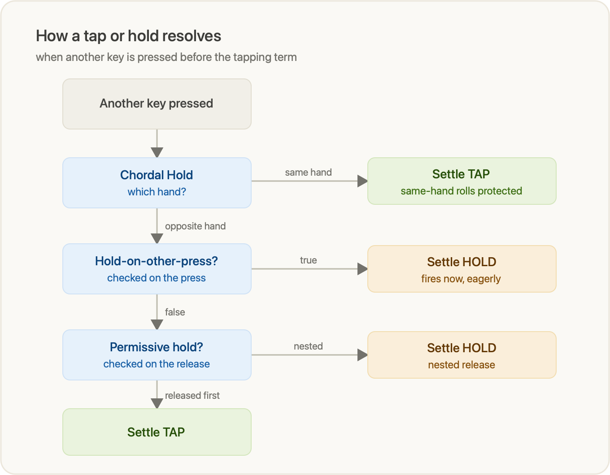
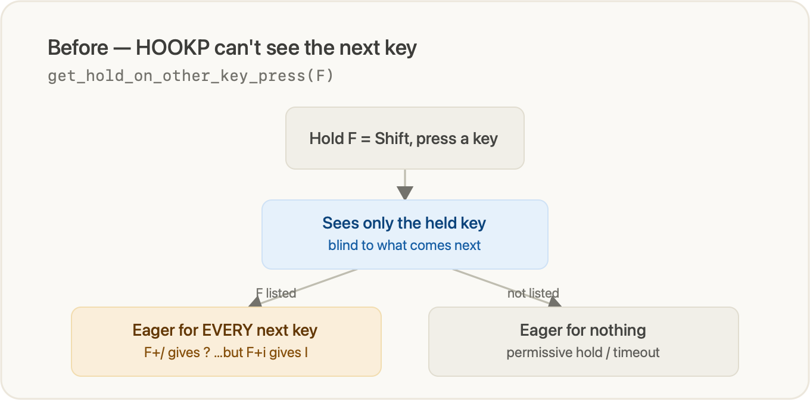
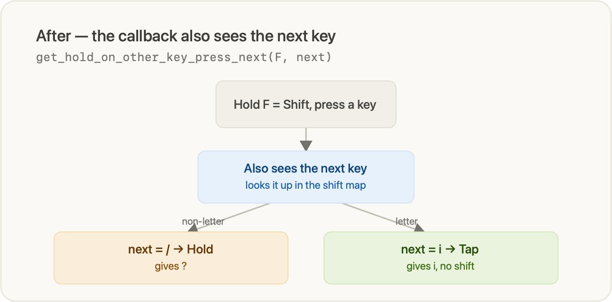
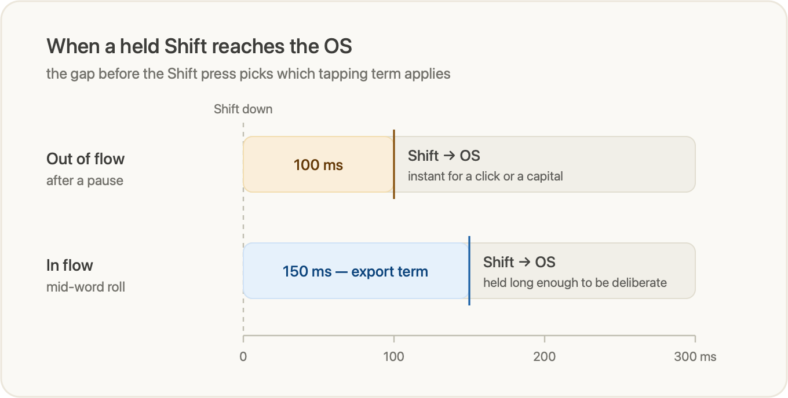
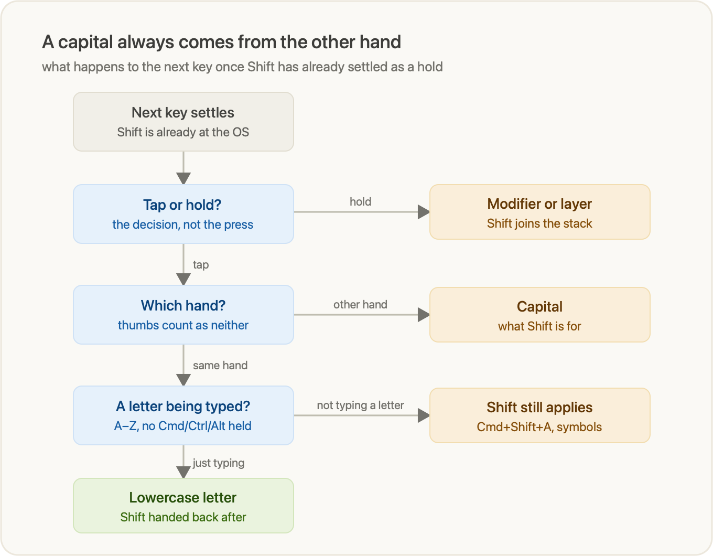

# Voyager Keyboard Helper

A bridge between **[ZSA Oryx](https://configure.zsa.io)** and **raw QMK**.

Design your layout in Oryx's GUI, then let this tool automatically inject the
QMK firmware-level features Oryx can't express — advanced tap/hold tuning,
custom per-key C callbacks, unlimited-length macros, even small patches to QMK
core — and flash it. One command, every time you re-export.

---

## Setup

```bash
./setup.sh
```

That's it. Following the [official QMK guide](https://docs.qmk.fm/newbs_getting_started),
the script installs the `qmk` CLI + toolchains, clones **ZSA's QMK fork**
([`zsa/qmk_firmware`](https://github.com/zsa/qmk_firmware), branch `firmware25`)
with submodules via `qmk setup`, installs the node dependencies, creates
`config.js` pointing at the checkout, and test-compiles the Voyager default
keymap to prove the build environment works. It asks where to put the QMK
clone (default: `~/voyager-keyboard/qmk`); for non-interactive use, pass
`QMK_HOME=/some/path ./setup.sh`. Safe to re-run — if `config.js` already
points at a QMK checkout, that checkout is reused and the clone is skipped.

Then edit [`config.js`](config.template.js): set your keymap name and the Oryx
export filename pattern (the defaults are the author's).

Then design your layout in Oryx, download the **QMK source** zip to `~/Downloads`,
and run:

```bash
node updateKeyboard.js
# or, if you put it on your PATH:
./flashKeyboard.sh
```
---

## Why not just Oryx?

Oryx is excellent at what it does: a visual layout editor, layers, RGB, combos,
tap-dance, basic mod-taps, and one-click flashing. But the moment you want
firmware behaviour Oryx doesn't expose, you're stuck with two bad options: fork
QMK and hand-maintain a full keymap (losing the GUI and re-doing it on every
change), or give up.

This helper gives you **both**. You keep the entire Oryx workflow — visual
editing, RGB, layer training — and layer QMK power on top **reproducibly**. Each
time you re-export from Oryx, one command re-applies your customizations onto the
fresh export and flashes.

| Capability | Oryx alone | With this helper |
|---|---|---|
| Visual layout / layers / RGB / combos | ✅ | ✅ (untouched) |
| Per-key tapping term | ✅ | ✅ (uses Oryx's) |
| Chordal Hold (bilateral) | on/off + default rule | full `get_chordal_hold` logic: per-chord exceptions, exemptions |
| Permissive-hold **per key** | ❌ | ✅ |
| Hold-on-other-key-press **per key** | ❌ | ✅ — and **next-key-aware** (core patch) |
| Quick-tap term per key | ❌ | ✅ |
| Tapping term per key | ✅ (fixed) | ✅ — and **flow-aware**: a different term while you're typing |
| Handedness enforced *after* Shift settles | ❌ | ✅ the same-hand Shift guard |
| Macros | length-limited | **unlimited** (placeholder expansion) |
| Arbitrary custom C / QMK core patches | ❌ | ✅ |

The philosophy: **Oryx owns the layout, the helper owns the firmware behaviour.**
Nothing here re-implements Oryx — it appends to the export.

---

## How the tap/hold decision works

This is the heart of the project, so it's worth understanding. When you press a
mod-tap (e.g. Shift on `F`) or layer-tap (e.g. number layer on `V`) and then
press **another key before the tapping term expires**, QMK runs a chain of
decisions to choose tap vs hold. The order matters:



1. **Chordal Hold (`get_chordal_hold`)** runs *first* as a handedness gate. If
   the next key is on the **same hand**, it settles as a **tap** — this is what
   stops fast same-hand rolls from firing accidental mods. Thumb keys are marked
   `*` and are exempt (they always pass through).
2. If the next key is on the **opposite hand**, **hold-on-other-key-press
   (HOOKP)** is checked *on the press*. `true` → settle as **hold immediately**
   (permissive hold is never consulted).
3. Otherwise the key stays pending and **permissive hold** is checked *on the
   release*: if the interrupting key is released first → **tap**; if it's nested
   (pressed and released while the mod-tap is still held) → **hold**.

> **No interrupting key at all:** the tapping term simply expires and the key
> resolves on plain release (tap) vs continued hold (hold) — none of the three
> callbacks are consulted. This is the gap the
> [same-hand Shift guard](#the-first-capital-comes-from-the-other-hand) closes.

**Whether a key opts into eager hold (step 2) is itself per-key**, and that split
is where most of the feel is tuned:

- **Shift** (`F` / `J`) — *flow-aware and next-key-aware*: pressed after a
  typing pause ("out of flow"), Shift eager-holds before **any** next key, so a
  sentence-start capital like `Ik` is instant. Mid-flow it eager-holds only
  before the keys marked in `shift_hold_on_other_layout` (opposite-hand numbers
  & symbols), so `F` + `/` → `?` is instant while `fish` stays `fish`. Whichever
  way it settles, the *first* same-hand letter afterwards is still typed
  lowercase. (See below.)
- **GUI / Ctrl / Alt** (`D`/`K`, `S`/`L`, `A`/`;`) — *timeout only*: no eager
  hold at all, so a fast roll can never flip one into an accidental mod; you hold
  past the tapping term to get the mod.
- **Thumbs, `V`, `=`** (layer-taps) — eager for **any** next key, so the layer
  switches the instant the next key goes down.

### Improving QMK for shift hold

In **stock QMK, only `get_chordal_hold` sees the interrupting keycode** — HOOKP
and permissive-hold are told *which* tap-hold key is deciding, but not *what* was
pressed next. So hold-on-other-key-press is all-or-nothing per key: you can't
make Shift hold eagerly before a symbol but not before a letter.

**Before — `get_hold_on_other_key_press(F)` is blind to the next key:**



This repo ships a tiny, idempotent QMK core patch
([`util/patchQmkCore.js`](util/patchQmkCore.js)) that **adds** a next-key-aware
variant, `get_hold_on_other_key_press_next(keycode, record, other_keycode,
other_record)`, and points the tapping FSM at it — without touching the original
callback or its other call sites.

**After — the patched callback also receives the next key:**



Now the keymap can scope eager-hold by the *next* key. The Shift home-row mods
consult a `shift_hold_on_other_layout` map — the same `LAYOUT(...)` shape as
`chordal_hold_layout`, so every cell is one physical key:

```c
const char shift_hold_on_other_layout[MATRIX_ROWS][MATRIX_COLS] PROGMEM = LAYOUT(
  '2','2','2','2','2','2',   '1','1','1','1','1','1',
  '2','.','.','.','.','.',   '.','.','.','.','.','1',
  '2','.','.','.','.','.',   '.','.','.','.','1','1',
  '2','.','.','.','.','.',   '.','.','1','1','1','1',
                  '.','.',   '.','.'
);
```

`'1'` = eager-hold when **left** Shift (`F`) is held, `'2'` = eager-hold when
**right** Shift (`J`) is held, `'.'` = never. The marks cover the opposite-hand
number row and outer symbol keys, so `F` + `/` → `?` fires instantly — while
every letter and thumb is `'.'`, so `fish` stays `fish` and `kijk` stays `kijk`.
Tune any cell by hand to taste.

### Flow state: instant capitals without breaking rolls

The matrix alone has a blind spot: with every letter `'.'`, a capital like `Ik`
only resolves as Shift via permissive hold (release the `i` before the `F`) or
by holding `F` past the tapping term. Roll off `F` first and you type `fik`.
But marking letters in the matrix would bring back the `fish` → `Ish` misfires
the matrix exists to prevent — the two are the same physical event, and only
**timing** tells them apart.

So the Shift keys also track flow state. A `pre_process_record_user` hook
(which sees every event *before* the tap-hold buffering) timestamps each
keypress; if `F`/`J` goes down more than `SHIFT_FLOW_TERM` (300 ms) after the
previous keypress, that Shift press is **out of flow** — the start of a word or
sentence, not a mid-word roll — and eager-holds before **any** next key,
letters included (Chordal Hold still settles same-hand chords as taps first).
In-flow presses keep the conservative matrix behaviour.

The result: `Ik` after a pause capitalizes the instant `i` goes down,
regardless of speed or release order, while mid-sentence rolls keep tapping.
The remaining trade-off is a rolled `fi`/`ji` at the start of a word typed
right after a pause (`fiets` as a first word can come out `Iets` if `F` is
still down when `i` lands); lower `SHIFT_FLOW_TERM` to make the pause detection
stricter.

Flow state also picks the Shift **tapping term** — how long `F`/`J` has to be
held, with no other key at all, before Shift is registered with the OS:



Out of flow the Shift was deliberate, so `SHIFT_OUT_OF_FLOW_HOLD_TERM` (100 ms)
gets it to the OS quickly — live as a real modifier for a shift-click or a
capital you're about to type slowly. In flow the per-key term from the Oryx
export (150 ms for `F`/`J`) still applies, so a slow letter is less likely to
turn into a mod mid-word. This term is the only thing standing between a letter
and a modifier: once it expires, Shift is on the wire and the guard below can
suppress it for a keypress but never take it back.

### The first capital comes from the other hand

Everything above decides the tap-vs-hold question *while the Shift is still
undecided*, and Chordal Hold guarantees the handedness there. But once Shift has
settled as a hold — the tapping term expired with no interrupting key — that
guarantee is gone: the next key is processed with Shift already registered, so a
same-hand roll capitalises. That's `eindelijk` coming out as `eindeliK`, because
`J` (right Shift) was held a fraction too long before `K` (also right hand).

So while a Shift mod-tap is held, the **first letter on the same hand** has
Shift stripped from its report and is typed lowercase:



The guard is deliberately narrow — it only ever touches `KC_A`–`KC_Z` on the
same hand, so `Shift`+symbol, `Shift`+arrow, `Shift`+thumb and shift-click are
all untouched, and a Shift held on the *opposite* hand always wins. Only the
Shift bits the mod-tap itself registered are ever borrowed — Shift from any
other source (a plain `Shift` key on another layer, Caps Word) is deliberate
and is left in the report, so its capital is typed. Shift is handed back on the
next key event, so it's borrowed for exactly one keypress and not for the rest
of the hold: `F`-held → `e` → `o` gives `eO`.

**The guard stands down once the hold proves itself.** Stripping same-hand
letters for the *whole* hold breaks the other direction: typing `GRAPH` with
right Shift held, `G`/`R`/`A` capitalise from the left hand but `P` and `H` come
back to the Shift's own hand and would be forced lowercase — `GRAph`. The two
cases separate cleanly on what happened *before* the same-hand letter. An
accidental hold (`eindelijk`) never gets an opposite-hand capital out first —
the same-hand letter is the very next thing that happens. A deliberate one puts
a capital on the wire immediately. So the first opposite-hand letter typed under
a live Shift is treated as proof the hold was meant, and from that point until
the Shift is released the guard is off and every following letter capitalises,
whichever hand it's on. The proof is tracked per hand and cleared with the hold,
so the next Shift press starts guarded again — `eindeliK` stays fixed.

**Modifier stacks are safe**, because the guard runs on the tap-vs-hold
*decision* rather than on the physical press. For a tap-hold key, QMK's
`action_tapping_process()` buffers the event and only calls `process_record()`
once the FSM has settled it, with `record->tap.count` set — `1` for a tap, `0`
for a hold. So `F` + `D` with `D` held past its term arrives at the guard as a
hold: it isn't a letter at all, Shift is never touched, and you get Shift+Cmd
even though both keys are on the left hand. The same `D` *tapped* arrives with
`tap.count == 1` and is treated as the letter it is.

That leaves one case the tap/hold split doesn't cover: a letter typed while a
stack is already up. `A` is `MT(MOD_LALT, KC_A)`, so in `Cmd`+`Shift`+`A` it
does reach the guard as a settled tap on the same hand as the Shift. A held
GUI/Ctrl/Alt is therefore read as "this is a chord, not typing", and Shift is
left alone.

> **Why the Shift key is counted out on its *processed* release.** When a mod-tap
> has settled as a hold, QMK defers its release until the current tapping
> finishes — *"Modifier should be retained till end of this tapping"* in
> `action_tapping.c`. So in a roll like `J`↓ `K`↓ `J`↑ `K`↑, Shift is still
> registered with the host well after `J` physically came up, and `K`'s tap is
> only decided at `K`↑. Tracking the held Shift in `pre_process_record_user` —
> which runs at physical event time, *before* the tapping FSM — would clear the
> hand too early and leave the guard blind for exactly that window, so `eindeliK`
> would still slip through on one of the two roll orders. The hand is therefore
> cleared in `process_record_user`, on the release QMK actually processes.

**The Shift key's own letter is never typed out late.** By the time the guard
runs, Shift has already gone to the OS as a modifier — that decision is on the
wire and it stands. So the Shift key produces a modifier or nothing, and the
same-hand letter that follows it is simply lowercase: out of flow, `F` held past
100 ms then `e` gives `e`, not `fe`. The cost is a dropped letter when the Shift
key really was meant as a letter and you held it too long (`fabriek` → `abriek`);
the defence against that is the tapping term, not a retroactive fix-up — shorten
it, or press the next key sooner so Chordal Hold settles it as a tap instead.

The implementation lives in `apply_same_hand_shift_guard()` in the keymap
snippet. It reads handedness straight out of Oryx's own `chordal_hold_layout`
via QMK's `chordal_hold_handedness()`, so there's no second map to keep in sync.

---

## How it works (the pipeline)

`node updateKeyboard.js` (or `./flashKeyboard.sh`) runs five steps:

| Step | File | What it does |
|---|---|---|
| 1. Find & unzip | [`util/findAndUnzip.js`](util/findAndUnzip.js) | Picks the newest Oryx export in `~/Downloads` matching `firmwarePattern` and unzips it to `tmp/`. |
| 2. Modify firmware | [`util/modifyFirmware.js`](util/modifyFirmware.js) | Copies the source → `_modified`, prepends/appends the [`snippets/`](snippets), expands macros, and rewrites the keymap (`TT()`→`MO()`, macro placeholders → full `SEND_STRING`, macro speed, and renaming Oryx's `process_record_user`/`get_tapping_term` so the snippet can wrap them). |
| 3. Move to QMK | [`util/moveToQMK.js`](util/moveToQMK.js) | Copies `_modified` into your QMK checkout's keymap folder. |
| 4. Patch QMK core | [`util/patchQmkCore.js`](util/patchQmkCore.js) | Idempotently applies the next-key-aware HOOKP mod to `quantum/action_tapping.{c,h}`. |
| 5. Flash | [`util/flash.js`](util/flash.js) | Runs `qmk flash`. |

The Oryx export is never edited in place — everything is layered on a copy, so
re-exporting and re-running is always safe and repeatable.

### The snippets

Your firmware customizations live in [`snippets/`](snippets) and are appended to
the matching Oryx file:

- [`snippets/config.h.snippet.js`](snippets/config.h.snippet.js) — feature flags
  (`PERMISSIVE_HOLD_PER_KEY`, `HOLD_ON_OTHER_KEY_PRESS_PER_KEY`,
  `QUICK_TAP_TERM_PER_KEY`).
- [`snippets/keymap.c.snippet.js`](snippets/keymap.c.snippet.js) — the tap/hold
  callbacks (`get_chordal_hold`, `get_permissive_hold`,
  `get_hold_on_other_key_press` + `_next`, `get_quick_tap_term`), the whitelist
  map, the flow-state tracking (`pre_process_record_user`), and the same-hand
  Shift guard in `process_record_user`.

  Two of these — `process_record_user` and `get_tapping_term` — are already
  defined by Oryx, and QMK allows only one definition of each. Step 2 renames
  the generated ones to `oryx_export_process_record` /
  `oryx_export_get_tapping_term`, and the snippet defines the real entry points,
  adds its own behaviour and delegates to Oryx's, so nothing Oryx expresses is
  lost. Both renames throw if the anchor ever disappears from an export, rather
  than silently dropping behaviour.

  The `oryx_export_` prefix matters. QMK's community-module system generates a
  weak hook named `<callback>_<module>` for every module, and ZSA ships one
  called `oryx` — so `process_record_oryx()` is already a QMK symbol that
  `process_record_modules()` calls on every key event. The earlier `*_oryx`
  naming silently overrode that stub and left the Oryx export body with two
  callers, which made every `SEND_STRING` macro fire twice. Any new name here
  must stay clear of the `<callback>_<module>` shape.
- [`snippets/rules.mk.snippet.js`](snippets/rules.mk.snippet.js) — build rules.
- [`snippets/macros.js`](snippets/macros.js) — unlimited-length macro expansion.
  Oryx caps macro length, so you create a short placeholder chord in Oryx (e.g.
  `Hyper+C`) and the helper rewrites it into the full `SEND_STRING` sequence.

---

---

## Repo layout

```
config.template.js          # copy to config.js — paths & filename pattern
updateKeyboard.js           # entry point: unzip → modify → move → patch → flash
flashKeyboard.sh            # thin wrapper around updateKeyboard.js
snippets/                   # your firmware customizations (appended to the export)
  config.h.snippet.js
  keymap.c.snippet.js
  rules.mk.snippet.js
  macros.js
util/
  findAndUnzip.js
  modifyFirmware.js
  moveToQMK.js
  patchQmkCore.js           # idempotent QMK core patch (next-key-aware HOOKP)
  flash.js
tmp/                        # working area (Oryx export + the modified copy)
```

---

## Note on the QMK core patch

`patchQmkCore.js` modifies files **inside your QMK checkout**, not this repo, so
it lives outside Oryx's world entirely. It's written to be:

- **idempotent** — safe to run on every build; a no-op once applied;
- **additive** — it *adds* `get_hold_on_other_key_press_next` and only repoints
  the tapping-FSM macro, leaving the stock callback and its other call sites
  intact, so the build stays healthy;
- **self-healing** — if you re-clone or `git pull` QMK and the patch is gone, the
  next run re-applies it.

If you don't need next-key-aware hold-on-other-key-press, you can drop the
`patchQmkCore()` call from `updateKeyboard.js` and the `_next` callback from the
keymap snippet; everything else works on stock QMK.
